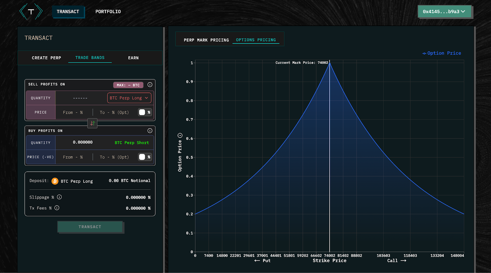

# 5. Pricing Logic

Band pricing is determined by the AMM.&#x20;

The price of a band at any given strike is a function of the reserves available at that strike:

$$
\mathbf{P_s = F(R_s)}
$$

* **s** is strike expressed in relative (%) terms vs. perp mark price at entry, not absolute dollar terms, e.g., a call option with a strike at +25% means the strike is set 25% above the prevailing perp mark price when the position is opened.
* **P****s** is the price at strike s, expressed as a fraction of the perp, e.g. a call with a strike of +30% from the entry perp mark price might be priced at 0.6 — meaning its value is 60% of the whole long perp, because it captures only a ‘slice’ of the perp’s total payout.&#x20;
* **R****s** is the reserves available at that strike
* **F** is the AMM’s pricing function.&#x20;

\
**Price impact of trades:** trades at strike ‘s’ affects the reserves — and therefore the pricing — at strikes further out of the money than  ‘s’.
